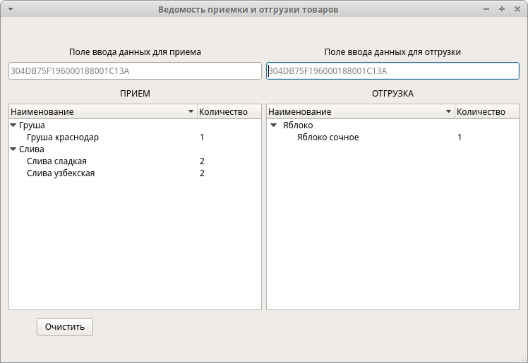

# Ведомость приемки и отгрузки товаров
### 1.  Общее описание Программного обеспечения
ПО предназначено для демонстрации сопоставления данных.
### 2.  Функциональное назначение Программного обеспечения
ПО предназначено для выполнения функций:
*	Накопление и отображение вводимых данных в заданных областях интерфейса;
*	Демонстрацию взаимодействия данных в заданных областях интерфейса;
### 3.  Требования к функциям и интерфейсу Программного обеспечения
Интерфейс основного окна ПО должен позволять переключаться в режим окна растянутого на весь экран и в оконный режим, а также позволять изменить размеры окна. При изменении размеров окна положение элементов, их размеры и пространство между ними должно пропорционально изменяться. 

ПО должно позволять выполнить формирование и редактирование ведомости приемки и отгрузки товаров из справочника номенклатуры, который должен содержать:
*	Идентификатор объекта, представляющий собой строку из **24-х HEX-символов**. Например, **304DB75F196000180001C13A**. Идентификатор объекта должен быть уникальным. Вводимые данные идентификаторов должны быть инвариантны к большим и маленьким буквам (прописным и строчным). При добавлении идентификатора строчные буквы должны автоматически преобразовываться в прописные;
*	Наименование объекта;

Справочник номенклатуры должен содержаться на ПЭВМ в виде файла, формат файла XML. 
Эскиз основного окна ПО приведен на Рис. 1.

ПО должно позволять ввести в поля **«Поле ввода данных для приема»** и **«Поле ввода данных для отгрузки»** идентификаторов объекта, представляющих собой строку из **24-х HEX-символов**. Например, **304DB75F196000180001C13A**. ПО должно позволять ввести как один идентификатор, так и группу из нескольких идентификаторов разделенных символом ПРОБЕЛ « ». Вводимые данные идентификаторов должны быть инвариантны к большим и маленьким буквам (прописным и строчным). При добавлении идентификатора строчные буквы должны автоматически преобразовываться в прописные. 

После ввода в указанных полях символа перевода строки (нажатие клавиши **Enter**) ПО должно производить поиск введенных идентификаторов в справочнике номенклатуры и добавлять в соответствующую таблицу (**«ПРИЕМ»** или **«ОТГРУЗКА»**) наименование найденного объекта или увеличивать **«количество»** уже отображаемых объектов.

Отображаемые в таблицах объекты должны быть группированы (свернуты) по наименованиям. В случае добавления уже существующих в таблице объектов – не должна формироваться новая запись,  должно лишь увеличиваться значение **«количество»** существующих объектов.

Если при добавлении в одну из таблиц (например, **«ПРИЕМ»**) объекта  из другой таблицы (**«ОТГРУЗКА»**), в которой объект с таким идентификатором уже существует – помимо добавления в таблицу **«ПРИЕМ»**, данный объект должен быть удален из таблицы **«ОТГРУЗКА»** (уменьшено количество или удалена запись). Аналогично при добавлении в таблицу **«ОТГРУЗКА»**.

Идентификаторы не присутствующие в справочнике номенклатуры должны игнорироваться.

При нажатии на кнопку **«Очистить»** ПО должно очищать таблицы **«ПРИЕМ»** и **«ОТГРУЗКА»**.
